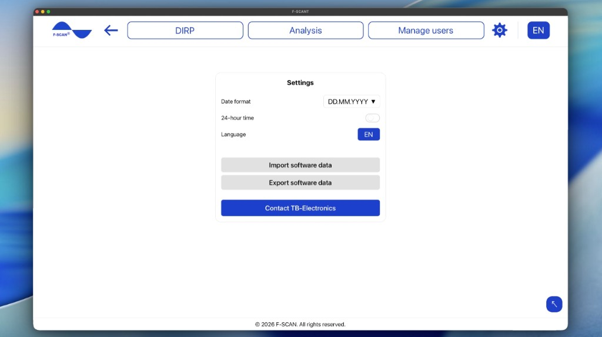

# Impostazioni

Fai clic sull’ingranaggio nel menu in alto per aprire **Impostazioni**.

Figura 10. **Impostazioni**: formato data, formato 24 ore, lingua, **Importa dati software** ed **Esporta dati software**.

## Come impostare data e ora

- **Formato data:** imposta l’ordine in cui vengono mostrate le date. Scegli **DD.MM.YYYY** (giorno prima, es. 25.10.2026), **MM.DD.YYYY** (mese prima, es. 10.25.2026) oppure **YYYY.MM.DD** (anno prima, es. 2026.10.25).
- **Formato 24 ore:** se è attivo, le ore appaiono come 14:30. Se è disattivo, appaiono come 2:30 PM.

Queste impostazioni cambiano solo il modo in cui data e ora appaiono in F-SCANT. Non modificano l’F-SCAN.

## Come impostare la lingua

**Lingua** in **Impostazioni**, oppure le lettere della lingua nella barra in alto, cambiano la lingua dell’interfaccia di F-SCANT.

Il menu mostra **EN**, **IT**, **DE**, **PL**, **CZ** (inglese, italiano, tedesco, polacco, ceco).

Parole come DIRP, Hz, **Fmin**, **Fmax**, **HITS** e **CLIP** restano uguali in ogni lingua. Anche i nomi delle persone e i nomi nel catalogo frequenze non vengono tradotti.

## Come importare ed esportare i dati del software

**Importa dati software** porta in F-SCANT utenti, DIRP e il catalogo frequenze da qualsiasi versione del software.

1. Fai clic su **Importa dati software**.
2. Scegli uno o più file, al massimo 10.000: un backup F-SCANT (`.json`) o un file F-SCANT3 (`.ft3`).
3. Scegli **Aggiungi solo le voci mancanti** o **Aggiungi tutte le voci (rinomina i duplicati)**. Le voci del catalogo con lo stesso nome e frequenza non vengono mai duplicate.
4. Mentre l’importazione è in corso, una barra di avanzamento mostra **Importazione di … file su …**, quanti file sono riusciti e non riusciti finora, e una stima del tempo rimanente. Le importazioni grandi possono richiedere diversi minuti.
5. Puoi premere **Annulla** durante un’importazione. I file in corso di importazione terminano, non viene importato altro e i file già importati restano su questo computer. Il riepilogo indica quanti file sono stati importati prima dell’annullamento.
6. Un riepilogo mostra quanti utenti sono stati creati o rinominati, quanti DIRP creati o saltati e quante voci del catalogo create, saltate o aggiornate, oltre ai file non riusciti. Se falliscono più di cinque file, **Esporta elenco errori** salva l’elenco completo con il motivo di ciascuno. Un singolo file importato con successo può mostrare una conferma più breve.

**Esporta dati software** salva in un unico file di backup gli utenti, i DIRP e il catalogo frequenze presenti su questo computer.

**Nota:** l’importazione aggiunge dati su questo computer. Verifica di avere i file corretti prima di continuare. Ciò che è memorizzato sull’F-SCAN non cambia finché non trasferisci qualcosa.

## Contatta TB-Electronics

**Contatta TB-Electronics** apre un’email a info@fscan.com.
